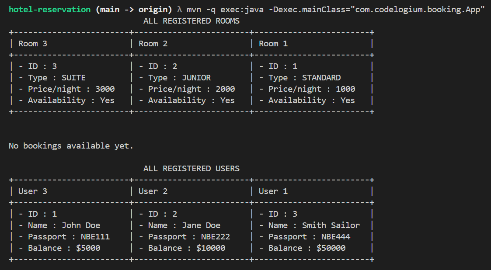
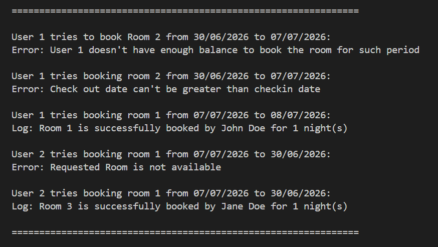
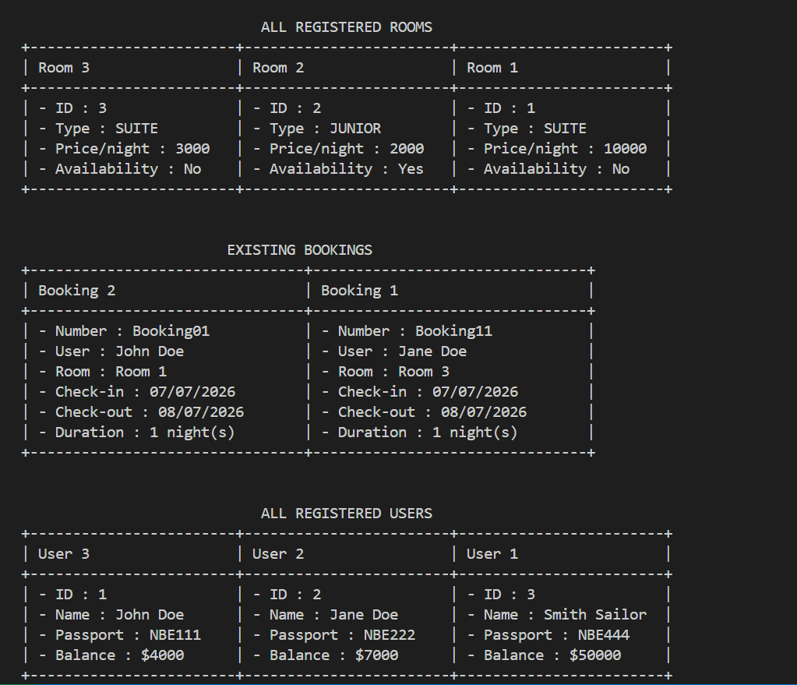

# Hotel-reservation (Booking)

Simple hotel reservation built in plain Java

## Overview

This is a simple Java project implementing the core functionalities of a hotel booking system, following the 3-tier architecture and using `ArrayList` to store various data. It includes setting rooms with their types, rates, etc., and users with their name, passport number, balance, etc., in order to make bookings.
It offers a clean console display of registered users, rooms, and available bookings, each with their details.

Note that the application was built using the Maven tool to allow for easy extension.

## Design Challenge

1. **Suppose we put all the functions inside the same service. Is this the recommended approach?**

   * Even though this is the approach followed in this application, it is not recommended, as it mixes business services by **tightly coupling them, making the codebase harder to maintain**. It also violates the **Single Responsibility Principle (SRP)**, a core concept of clean software architecture, which could negatively impact the application as more business services are added<br>.

2. **In this design, we chose to have a function `setRoom(..)` that should not impact previous bookings. What is another way?**

   * Using `setRoom(..)` to update room details without affecting past bookings is a good intention, as it preserves the immutability of booking history. However, directly modifying a room that was part of a past booking can lead to **data inconsistency** if not handled carefully.
   * Another way would be to ensure that any update on a room does not alter the data associated with previous bookings, thereby preserving booking history even if room details change later<br>.

3. **What's followed:**

   * All business services are in one class (`BookingService`), which tightly couples various business concerns, including those not directly related to booking.
   * Each entity (`Booking`, `Room`, `User`) has its own repository using an `ArrayList` as the datastore.
   * Deep copying is used when retrieving objects to update, in order to protect the integrity of stored data.
   * Exceptions and invalid inputs are handled via `System.err` outputs in a way that does not interrupt application execution.
   * With this approach, repositories had to be instantiated manually in the main class (`App.java`) instead of relying solely on services.

4. **Folder Structure**

```
src
└── main
    └── java
        └── com
            └── codelogium
                └── booking
                    ├── constants
                    │   └── RoomType.java
                    ├── entity
                    │   ├── Booking.java
                    │   ├── Room.java
                    │   └── User.java
                    ├── repository
                    │   ├── BookingRepository.java
                    │   ├── RoomRepository.java
                    │   └── UserRepository.java
                    ├── service
                    │   ├── BookingService.java
                    │   └── BookingServiceImpl.java
                    └── App.java
└── test
    └── java
        └── com
            └── codelogium
                └── booking
                    └── AppTest.java
```

## Testing

No unit tests for now.
They could easily be added, since the app is built using Maven.

---

## How to Compile and Run

Make sure you have **Java (JDK 8+)** and **Maven** installed.

1. **Clone the project**

   ```bash
   git clone https://github.com/alfahami/hotel-reservation.git
   cd hotel-reservation
   ```

2. **Compile the project**

   ```bash
   mvn compile
   ```

3. **Run the application**

   ```bash
   mvn -q exec:java -Dexec.mainClass="com.codelogium.booking.App"
   ```
 If `exec-maven-plugin` is not configured yet, you can add it under `plugins` in your `pom.xml`.

---

* **Unit Testing**:
  While the current version does not include unit tests, the project structure (Maven-based and modular) allows for easy integration of testing frameworks like **JUnit**.
  Future improvements could include:

  * Writing unit tests for each service and repository class.
  * Adding input validation tests, edge case scenarios, and error handling verifications.
---

## Screenshots
1. After registering 3 users and 3 rooms


2. Attempts bookings (some failed, some succeeded)


1. Updated bookings, rooms, users after successful bookings


## Future Scope

* **Service Separation**:
  Currently, all business logic is managed under a single service class (`BookingService`). As the application grows, separating services by domain — such as `RoomService`, `UserService`, and `BookingService` — would improve maintainability, testability, and adherence to clean architecture principles like SRP.
---

## Notes

This project offers a basic but solid foundation for a hotel booking system using plain Java. While simple and console-based, it allows for easy future improvements like separating services, adding unit tests, and integrating persistent storage.


